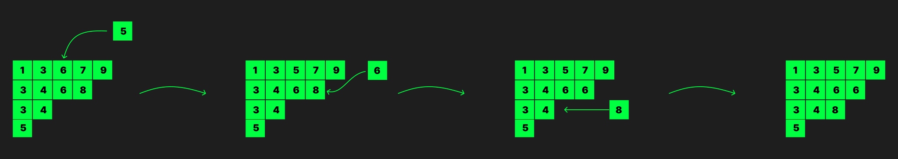

+++
title = "Young Cryptography"
date = 2026-08-11
authors = ["Swaminath Shiju", "Sriram V"]
+++

# Young Cryptography UIUCTF26
## Description

The Princess has sent you an encrypted message, but The Enemy has stolen your secret key! Can you recover the message?

## Solution

> This challenge was solved organically ✨✨

The provided [`chal.py`]("./attachments/chal.py") was a key exchange facilitated using sparse symmetric
matrices and a crazy product function.

``` py
def my_prod(A, B):
    n = len(A)
    z = (0,) * n

    def f(a, b, c, x):
        return (max(b[0], c[0]) + x,) + tuple(
            min(b[k-1], c[k-1]) + max(b[k], c[k]) - a[k-1]
            for k in range(1, n)
        )

    r = [z] * (n + 1)
    for row in A + B:
        s = [z]
        for j, x in enumerate(row, 1):
            s.append(f(r[j-1], r[j], s[-1], x))
        r = s

    p = [[None] * (n + 1) for _ in range(n + 1)]
    for i in range(n + 1):
        p[i][n] = r[i]

    C = [[0] * n for _ in range(n)]
    for i in range(n-1, -1, -1):
        for j in range(n-1, i-1, -1):
            b = p[i][j+1]
            c = p[i+1][j] if i < j else b
            d = p[i+1][j+1]

            C[i][j] = C[j][i] = d[0] - max(b[0], c[0])
            p[i][j] = tuple(
                min(b[k], c[k]) +
                (max(b[k+1], c[k+1]) - d[k+1] if k+1 < n else 0)
                for k in range(n)
            )

    return C
```

Initially we spent some time analyzing the product to see if some nice
properties like linearity or commutativity were followed. The product only
yielded associativity which didn't lead to anything else.

Then we fell into an amazing rabit hole of the delightfully named [Tropical
Geometry](https://en.wikipedia.org/wiki/Tropical_geometry) which, also
unfortunately didn't help much.


Looking at the name of the challenge again somewhere in the recesses of my mind
I remembered a combinatorial object I'd seen in an old [Numberphile
video](https://www.youtube.com/watch?v=vgZhrEs4tuk) a while back called Young
Tableau.

The definition of a young tableau (French for _shockingly_ table) is rather
simple, but like most things in this neck of math it is deceptively so.

> A Young diagram (also called a Ferrers diagram, particularly when represented
using dots) is a finite collection of boxes, or cells, arranged in
left-justified rows, with the row lengths in non-increasing order. (taken from
[Young_tableau](https://en.wikipedia.org/wiki/Young_tableau))

A young tableau is an objected obtained by filling in the boxes of the diagram
with symbols from a totally ordered alphabet (usually taken as some set of
numbers for brevity).

The tableau can further be called semi standard if the entries are
non-decreasing along rows and strictly increasing down columns. It is called
standard if the entries are strictly increasing along both rows and columns,
and contains all symbols of the alphabet.

After some digging we came across is some nice properties of the tableau that
showed similarities of elements to the question, namely the
[Robinson–Schensted](https://en.wikipedia.org/wiki/Robinson%E2%80%93Schensted_correspondence)
(RS) correspondence and its generalization the
[RSK](https://en.wikipedia.org/wiki/Robinson%E2%80%93Schensted%E2%80%93Knuth_correspondence)
correspondence (K being Knuth).

### Insertion operation on tableaux

Schensted devised an insertion operation on tableaux for adding an element given
a semi-standard tableaux. Intuitively it pushes the first element larger than
the insertion element out and continues insertion starting from the next row.
The process ends when the insertion element is greater than the largest element
in the row in which case it appends to the row or the element forms a new row.

Example:

Suppose in the below tableau, we are inserting 5, then the following steps are to be done:

> 

### Robinson Schensted correspondence

Permutation $\sigma$ of $\{1\ldots n\}$ can be written as 

$$
\sigma = \begin{pmatrix}
1 & 2 & \ldots & n \\
\sigma_1 & \sigma_2 & \ldots & \sigma_n
\end{pmatrix}
$$

where $\sigma(i) = \sigma_i$.

The RS correspondence is a bijection between permutations and a pair of standard tableaux obtained as follows.

Let $P, Q$ be empty tableaux. Let $\leftarrow$ denote insertion and let $s$ be the square into which the last number during got placed during each insertion. Now for each $i$ increasing from $1$ to $n$ compute $P
\leftarrow \sigma_i$ and the square $s$ by the insertion procedure; after each insertion, put the number $i$ to the square $s$ of the tableau $Q$. Note that both P and Q maintain the same structure, i.e. each corresponding row and column have same size, after each insertion.

If $\sigma$ is a generalized permutation (i.e has repeated elements in the
first row, basically just a two line array) the bijection is from generalized
permutations to pairs of semi-standard tableaux.

Can be done in Sage using `.bump(T)`.

### Robinson Schensted Knuth correspondence

Knuth used a bijection between a matrix and two line arrays in lexicographic order defined as follows.


The two line array corresponding to matrix $A$ is defined as

$$
w_A = \begin{pmatrix}
i_1 & i_2 & \ldots & i_n \\
j_1 & j_2 & \ldots & j_n
\end{pmatrix}
$$

where the column ${i \choose j}$ occurs $A_{i,j}$ times and the array is in lexicographic order.

He applied the RS correspondence on the resultant two line array to create a
bijection between matrices and pairs of semi-standard tableaux.

> From a non trivial property of the RS correspondence symmetric matrices correspond to pairs of identical tableaux

This also coincidently bears some resemblance to what the random matrix
function in `chal.py` looks like, it creates a random two line array and finds
its corresponding matrix

```py
def random_matrix():
    M = [[0] * N for _ in range(N)]
    for _ in range(n // 2):
        i, j = sorted([random.randrange(N), random.randrange(N)])
        M[i][j] += 1
        M[j][i] += 1
    return M
```

So the gut feeling was that hopefully the weird product function on matrices
would decompose to some easier to work with transformation on corresponding
tableaux.

Attempting that on small matrices

```py
N = 16
n = 16

...

A = random_matrix()
B = random_matrix()

from sage.combinat import rsk

print(rsk.RSK(A)[0])
print(rsk.RSK(B)[0])
print(rsk.RSK(my_prod(A, B))[0])
```

gave

```
[OUTPUT]
```

This was clearly much simpler. The elements and a semblence of structure seem
to be preserved. The output looked like what you might get by using Schensted
insertion iteratively on one tableau using the elements of the other tableau.

With a little guess work we figured out the order in whcich they were being
inserted. This turned out to be a general operation on tableaux and can be done
using Sage's `.bump_multiply(T)` function.

The aim of the challenge was to find $A \otimes G \otimes B$ from $G$, $A \otimes G$
and $G \otimes B$. The most straight forward approach is deducing $A$ from $A
\otimes G$ and then doing $A \otimes (G \otimes B)$. This would then translate to finding a tableau $T_A$ such that
$T_A.\text{bump\_multiply}(T_G) = T_{AG}$ where $T_G, T_{AG}$ are the tableau
corresponding to $G, AG$.

> TODO: Explain Plactic Monoids

> TOOD: Link papers


